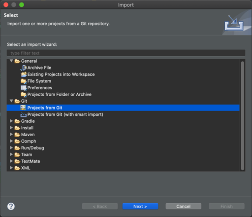
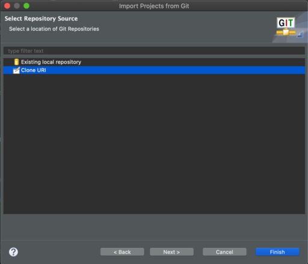
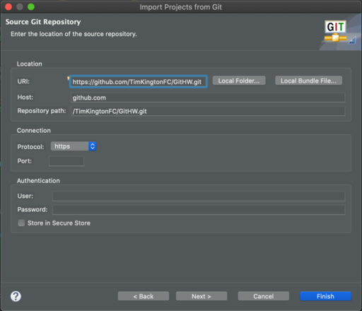
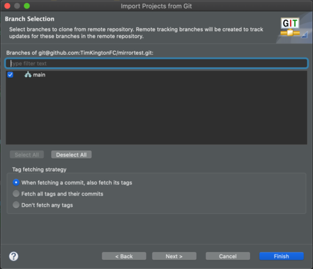
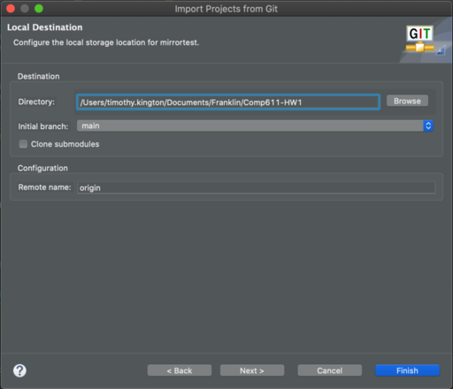
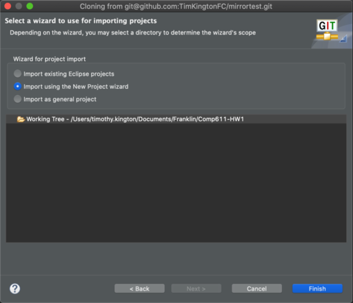
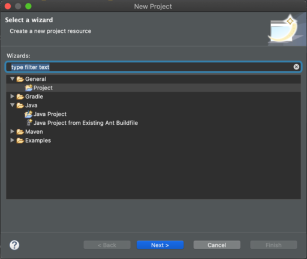
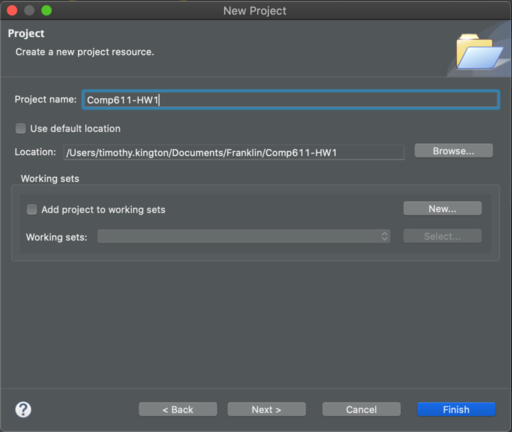

# Importing from Git into Eclipse

1. If this is the first assignment, fork the main repository on GitHub. For subsequent assignments, you should see a message in your forked repository that says "This branch is N commits behind <repo name>:main".  To sync the changes:
    1. Click "Pull Request" next to the message.
    1. For base repository select yours, and for head repository select mine.  Click "Create Pull Request".
    1. Give the PR a title, and click "Create Pull Request".
    1. Click "Merge Pull Request", and then "Confirm merge".

1. Go to File -> Import..., select "Projects from Git", and click Next.

    
  
1. Select "Clone URI", and click Next.

    
  
1. Enter the Clone URI for this repository (you can get it from the code button on the main page of the repository).
1. Enter your GitHub credentials.
1. Click Next.

    
    
1. The repository should load, and you should see the main branch.
1. Click Next.

    
    
1. Select a directory for this project, and make a note of the full path.
1. Click Next.

    
    
1. If this is the first import you've done, you can select "Import existing Eclipse projects", select the project, and you're done.  If you already have a project that you've imported that way, select "Import using the New Project wizard" and continue with the rest of the steps.
1. Click Next.

    
    
1. Select General -> Project, **NOT Java Project**.
1. Click Next.

    
    
1. Give the project a name.
1. Uncheck "Use default location", and change Location to the directory you chose earlier.
1. Click Finish.

    

1. [Write some code](../git-eclipse/README.md)!