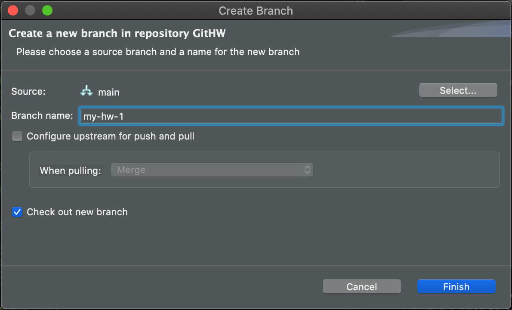

# Working With Git In Eclipse

1. For the first assignment, you won't need to pull changes from upstream, so skip this step.
    1. Right-click your project, and select Team -> Remote -> Fetch From...
    1. Enter the URI for **my** repository.

    

    1. For "Source ref", choose refs/heads/main, and for "Destination ref", choose refs/remotes/origin/main.  Click "Add Spec", and then Finish.

    

1. Make sure you create a new branch before writing any code - this way you'll be able to sync with changes in the main repo for future assignments.  Right-click the project, and select Team -> Switch To... -> New Branch.  In the new branch dialog give the branch a name, set Source to main, and make sure "Check out new branch" is checked.

    

1. Write some code.
1. When you're ready to commit changes, right-click your project and select Team -> Commit...  The Git Staging view will be displayed.

    

1. Your changed files should be in the Staged Changes area.  These are the changes that will be committed.  You can drag files between the Staged and Unstaged Changes to control what will be committed.
1. Enter a commit message, and click "Commit and Push...".  You should be able to accept the defaults in the Push Branch dialog.  Your Remote will look a bit different from mine because I'm using an SSH URI.

    

1. Go look at your project on GitHub, and you should be able to switch to your branch, and view your changes.  Don't create a PR and merge your changes to main - then you'll have problems pulling in changes for the next assignment.