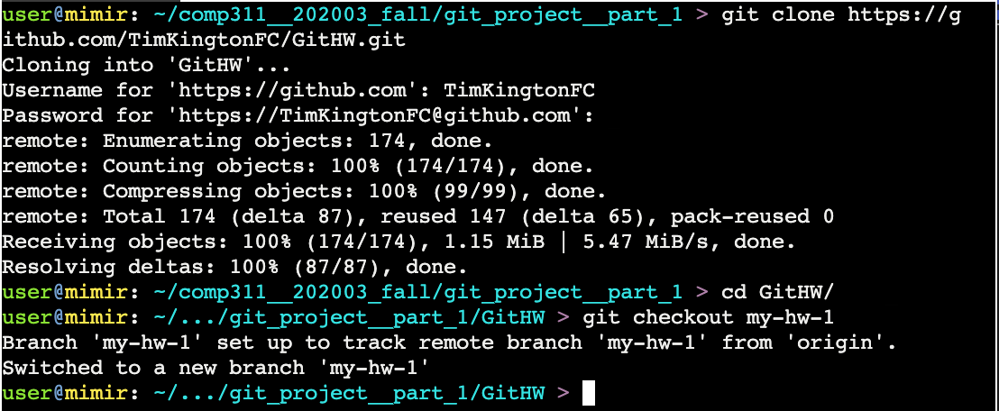
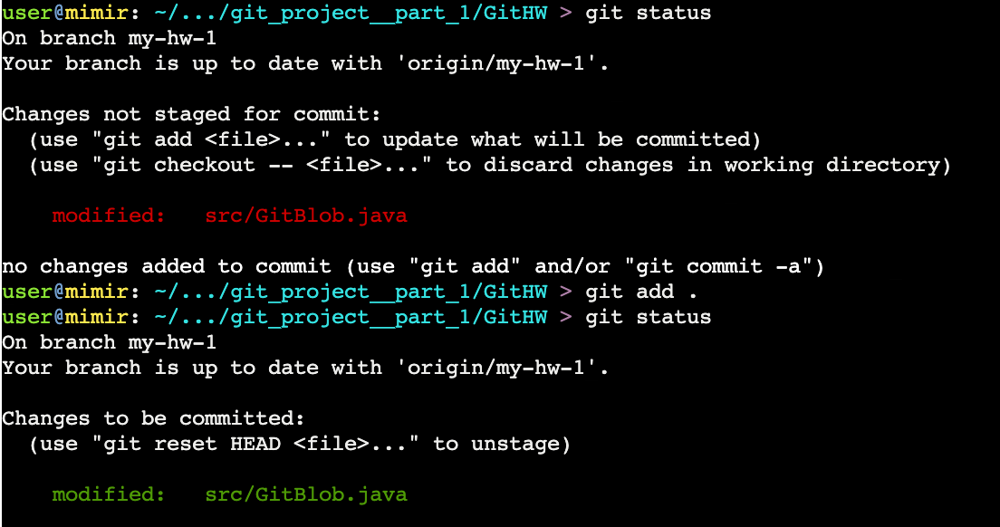
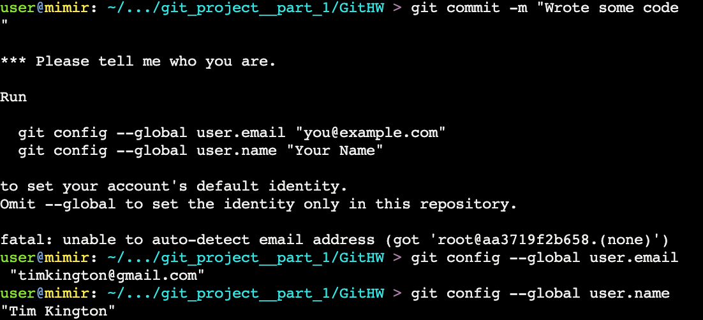
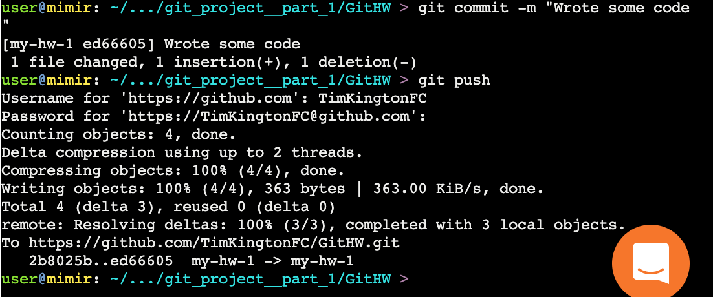

# Working With Git In Mimir

Once your code is ready to submit, you can pull it into Mimir using Git.

1. Open the Mimir IDE, and in the terminal `cd` to the folder for the current assignment. 

1. Clone your repo with `git clone <repo URI>`
1. `cd` into the repo directory.
1. Use `git checkout <branch name>` to switch to the branch with your code.

    

1. Click the Submit button in the upper right, and submit your code.  When Mimir asks for a folder to submit, select the src directory inside the repo directory you cloned.

1. You can continue to make changes to your code, and resubmit to pass more tests.  When you've finished, or if you want to move the changes back to Eclipse, you can commit and push from Mimir.
1. `git status` will show you what changes exist locally.
1. Use `git add` to stage changes that you want to commit.  If you add `.`, that will stage everything in the current directory, but you can stage individual files if you don't want to commit everything.
1. `git status` will now show that your files have been staged for commit. 
    

1. The first time you try to commit files, git won't know who you are, so you'll need to set your name and email address.

    

1. `git commit -m <your commit message>` to create a commit containing your changes.
1. `git push` to push that commit back to GitHub.

    

1. Go look at your project on GitHub, and you should be able to switch to your branch, and view your changes.  Don't create a PR and merge your changes to main - then you'll have problems pulling in changes for the next assignment.

1. If you want to pull your changes back into Eclipse, you can right-click the project and select Team -> Fetch from origin.